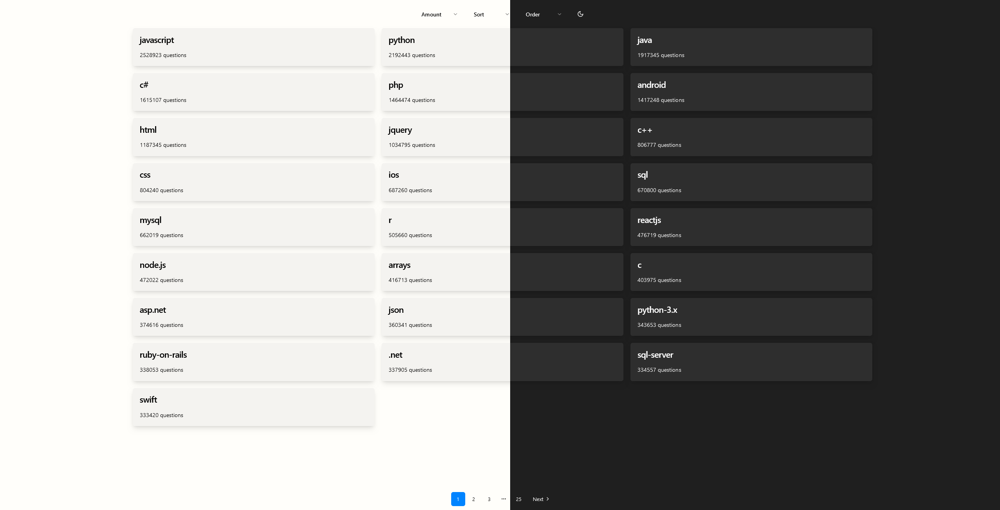

<a name="readme-top"></a>

<!-- PROJECT TITLE -->
<div align="center">
   <h3 align="center">
      StackOverflow Tags Browser
   </h3>

   <p align="center">
      Recruitment task
   </p>
</div>

<!-- TABLE OF CONTENTS -->
<details>
   <summary>Table of Contents</summary>
   <ol>
      <li>
         <a href="#about-the-project">About The Project</a>
         <ul>
            <li><a href="#built-with">Built With</a></li>
         </ul>
      </li>
      <li>
         <a href="#getting-started">Getting Started</a>
         <ul>
            <li><a href="#prerequisites">Prerequisites</a></li>
            <li><a href="#installation">Installation</a></li>
            <li><a href="#storybook">Storybook</a></li>
         </ul>
      </li>
      <li><a href="#contact">Contact</a></li>
   </ol>
</details>


<!-- ABOUT THE PROJECT -->
## About The Project

   

   </br>

   <p align="center">
      StackOverflow Tags Browser is a React-based user interface designed to browse tags provided by the StackOverflow API.
   </p>

### Features

   * Paginated table of tags along with the count of related posts.
   * Configurable number of items per page using a select field above the table.
   * Ability to choose sorting field and direction through sort and order selects.
   * Handling loading states and errors during data retrieval.
   * Utilization of TanStack Query for state management and data fetching.
   * Setup of Storybook for showcasing utilized application components.

   <p align="right">(<a href="#readme-top">back to top</a>)</p>

### Built With

   * [![React][React.js]][React-url]
   * [![TypeScript][TypeScript]][TypeScript-url]
   * [![Vite][Vite]][Vite-url]
   * [![Tailwind CSS][TailwindCSS]][Tailwind-url]
   * [![React Query][React Query]][ReactQuery-url]
   * [![Radix UI][Radix UI]][RadixUI-url]
   * [![Shadcn][Shadcn]][Shadcn-url]
   * [![Storybook][Storybook]][Storybook-url]


   <p align="right">(<a href="#readme-top">back to top</a>)</p>

<!-- GETTING STARTED -->
## Getting Started

### Prerequisites

   This project uses NPM as package manager
   ```sh
   npm install npm@latest -g
   ```

### Installation

   1. Clone the repo
      ```sh
      git clone https://github.com/asuujx/stackoverflow-tags-browser.git
      ```
   2. Install NPM packages
      ```sh
      cd stackoverflow-tags-browser
      npm ci
      ```
   3. Run the development server
      ```sh
      npm start
      ```
   4. Paste given URL to the browser
      ```
      http://localhost:5173
      ```

### Storybook

   This project utilizes Storybook for component documentation.
   ```sh
   npm run storybook
   ```

   <p align="right">(<a href="#readme-top">back to top</a>)</p>

<!-- CONTACT -->
## Contact

   Gmail - balon.piotr@gmail.com
   Linkedin - [/in/balonpiotr](https://www.linkedin.com/in/balonpiotr/)

   Project Link: [https://github.com/asuujx/stackoverflow-tags-browser](https://github.com/asuujx/stackoverflow-tags-browser)

   <p align="right">(<a href="#readme-top">back to top</a>)</p>


<!-- TECH STACK BADGES AND LINKS -->
[React.js]: https://img.shields.io/badge/React-20232A?style=for-the-badge&logo=react&logoColor=61DAFB
[React-url]: https://reactjs.org/

[TailwindCSS]: https://img.shields.io/badge/tailwindcss-%2338B2AC.svg?style=for-the-badge&logo=tailwind-css&logoColor=white
[Tailwind-url]: https://tailwindcss.com/

[TypeScript]: https://img.shields.io/badge/typescript-%23007ACC.svg?style=for-the-badge&logo=typescript&logoColor=white
[TypeScript-url]: https://www.typescriptlang.org/

[React Query]: https://img.shields.io/badge/-React%20Query-FF4154?style=for-the-badge&logo=react%20query&logoColor=white
[ReactQuery-url]: https://tanstack.com/query/latest

[Radix UI]: https://img.shields.io/badge/radix%20ui-161618.svg?style=for-the-badge&logo=radix-ui&logoColor=white
[RadixUI-url]: https://www.radix-ui.com/

[Shadcn]: https://img.shields.io/badge/-shadcn/ui-000000?style=for-the-badge&logo=shadcnui&logoColor=white
[Shadcn-url]: https://ui.shadcn.com/

[Storybook]: https://img.shields.io/badge/-Storybook-FF4785?style=for-the-badge&logo=storybook&logoColor=white
[Storybook-url]: https://storybook.js.org/

[Vite]: https://img.shields.io/badge/vite-%23646CFF.svg?style=for-the-badge&logo=vite&logoColor=white
[Vite-url]: https://vitejs.dev/